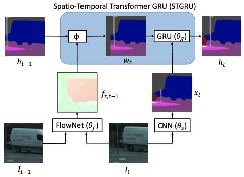

# video_segmentation

An implementation of GRFP[1] for the semantic segmentation of leaf images. Our goal is to segment 6 types of plants from the overhead images of an autonomous garden (see the example below). The segmentation output will be used in downstream tasks such as guiding robots to prune the garden.
We treat the images as video sequences and leverage the probability maps of previous frame(s) to provide additional spatio-temporal info for the segmentation of current frame. The architecture is shown below. We use a ResNet18-based[2] U-Net[3] as the static CNN and FlowNet2[4] as the FlowNet. The mean IoU on the test set is 78.4%.

## Result
Mean IoU on our test set is 78.4%. Here is one example image to segment and the visual comparison between the hand-labeled ground truth and our prediction.\

## Architecture
For details, please refer to [1]\

## References
[1] D. Nilsson, C. Sminchisescu. Semantic Video Segmentation by Gated Recurrent Flow Propagation. In CVPR, 2018\
[2] K. He, X. Zhang, S. Ren, and J. Sun. Deep Residual Learning for Image Recognition. arXiv preprint arXiv:1512.03385, 2015\
[3] O. Ronneberger, P. Fischer, and T. Brox. U-Net: Convolutional Networks for Biomedical Image Segmentation. arXiv preprint arXiv:1505.04597, 2015\
[4] E. Ilg, N. Mayer, T. Saikia, M. Keuper, A. Dosovitskiy, and T. Brox. FlowNet 2.0: Evolution of Optical Flow Estimation with Deep Networks. arXiv preprint arXiv:1612.01925, 2016
